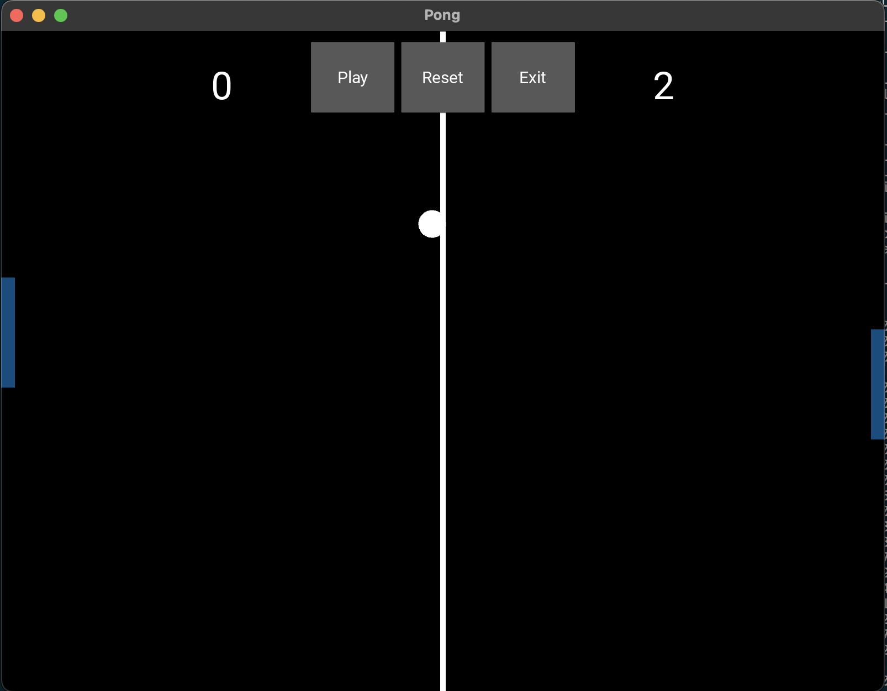

# Pong Mini-Game



## Introduction

Welcome to Pong, a classic two-player tennis table game implemented in Python using the Kivy framework. This project was created as a learning exercise to explore game development with Kivy.

## Features

- Two-player mode: Compete with a friend in a fun and interactive Pong match.
- Easy-to-use controls: Move your paddle up and down to hit the ball and score points.
- Real-time scoring: Keep track of your score and see who emerges as the Pong champion.
- Graphical User Interface (GUI): The game's GUI is designed using Kivy, a powerful Python framework for building multi-touch applications.

## How to Play

1. Clone or download this repository to your local machine.
2. Ensure you have Python and Kivy installed on your system.
3. Run the `main.py` script using Python to start the game.
4. Use the arrow keys or touch gestures (on touch-enabled devices) to control your paddle.
5. Compete with your friend to see who can score the most points!

## Installation

To run this Pong mini-game, you'll need to have Python and Kivy installed on your system.

1. Install Python: [Download Python](https://www.python.org/downloads/) and follow the installation instructions.
2. Install Kivy: Run the following command to install Kivy using pip.

```
pip install -r requirements.txt
```


## Acknowledgements

This project was inspired by the classic Pong game and created for educational purposes. 

## License

This project is licensed under the MIT License - see the [LICENSE](LICENSE) file for details.

Enjoy the game and have fun playing Pong! If you have any feedback or suggestions, feel free to contribute to this project or get in touch with us.
